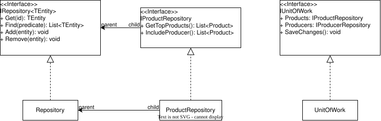

# README

The code follows Mosh [Repository and UnitOfWork Pattern](https://www.youtube.com/watch?v=rtXpYpZdOzM), meaning every repository are fully encapsulated within a, and can be accessed via, a single `UnitOfWork` object, making it less confusing and more efficiency whenever there's a need to call multiple repositories.

As the above diagram shows, these two patterns compliments each other.

1. **The Repository Pattern**: Which consists of two parts.
    1. The `IRepository` and its `Repository` implementation contain CRUD (with the exception of _Update_) and other basic queries that is shared and usable by all other repositories. Both the interface and the implementation **must** be generic, hence the usage of `<T>`.
    2. A specific `I*Repository` interface and its implementation; the former inherits `IRepository` only, while the latter inherits the interface, `IRepository` and `Repository`. This part contains data queries that is specific to a specific EF Core Model class, so it is important to de-generalise `<T>` functions with said specific class.
2. **The UnitOfWork Pattern**: Contains every repositories in the project, as well as a method that calls `DbContext.SaveChanges`. When instancing, pass the `DbContext` as a parameter and store it in the `UnitOfWork` object. Whenever we access one of its repositories, we can be sure it's the same `DbContext` that is used.

In a previous version, certain repository methods had `IQueryable` as a return type because it allowed for customisable queries at the Service layer.
However I've later come to learn that this exposes the DbContext and, consequently, the database structer to any code that calls those methods. For a proper Repository Pattern, the

and as such the current design
Technically, this goes against how proper repository patterns are structered,
repositories are only allowed to return `IQueryable` would technically break

because of the repositories are encapsulated, I could no longer use

# Changes

Due to my own misunderstanding on how to structure a _"Database First"_-database, my previous database had too many interconnected table leading to massive technical debt later on.

For example, instead of having separate _Employee_ and _Student_ tables, both inherited the same _Human_ table (which contained shared info e.g. name and SSN) using their own primary key as the foreign key.
This was one of many reason that made the database:

1. a pain to fetch data from, as the server had to enter the _Human_ table first before accessing the others.
2. confusing to navigate, as no identification existed to differentiate between which _Human_ was a _Student_, or an _Employee_, or both.
3. not very robust, as adding a new _Student_ necessitated adding an equivalent _Human_ as well.

## Changes

- Made many changes to database tables.
    - Compare the old diagram... 
    - ... With the new diagram 

https://www.youtube.com/watch?v=rtXpYpZdOzM

# LINQ queries

A console application for testing various LINQ queries, as well as Repository and Service patterns.
Tested out:

- IQueryable and AsQueryable()
- AsNoTracking()

I was unfortunately unable to use Dependency Injections so much of the code is still very coupled to each other.

Note: The SQL file for recreating the database, as well as the SQL query file, is stored inside the Script folder.
