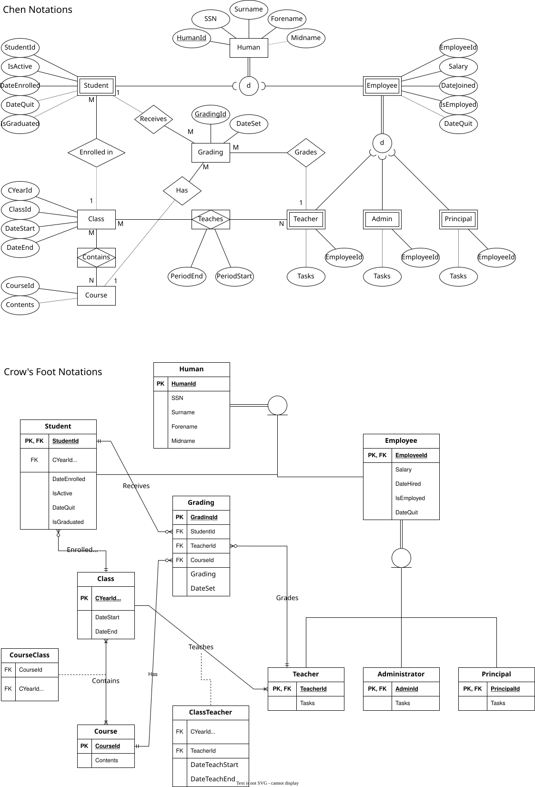
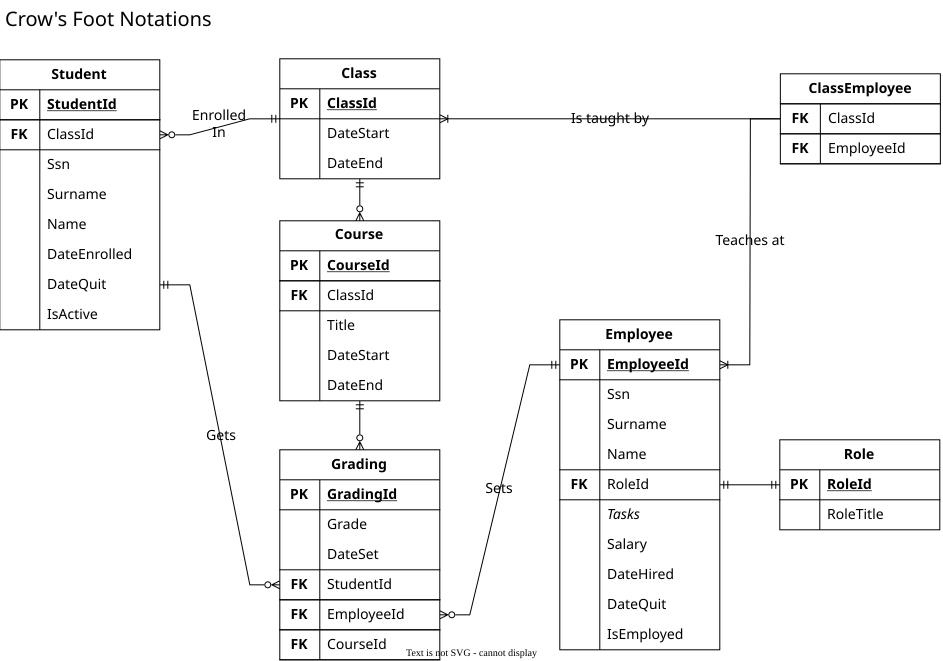

# Changes

Due to my own misunderstanding on how to structure a _"Database First"_-database, my previous database had too many interconnected table leading to massive technical debt later on.

For example, instead of having separate _Employee_ and _Student_ tables, both inherited the same _Human_ table (which contained shared info e.g. name and SSN) using their own primary key as the foreign key.
This was one of many reason that made the database:

1. a pain to fetch data from, as the server had to enter the _Human_ table first before accessing the others.
2. confusing to navigate, as no identification existed to differentiate between which _Human_ was a _Student_, or an _Employee_, or both.
3. not very robust, as adding a new _Student_ necessitated adding an equivalent _Human_ as well.

## Entity Relations

Database ER diagram comparison

### Initial diagram

### Latest diagram

# LINQ queries

A console application for testing various LINQ queries, as well as Repository and Service patterns.
Tested out:

- IQueryable and AsQueryable()
- AsNoTracking()

I was unfortunately unable to use Dependency Injections so much of the code is still very coupled to each other.

Note: The SQL file for recreating the database, as well as the SQL query file, is stored inside the Script folder.
